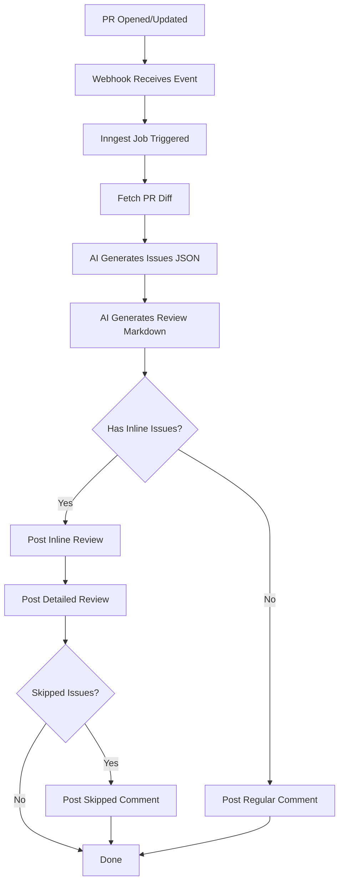

# 🎉 INLINE REVIEW FEATURE - FULLY INTEGRATED

## ✅ What's Been Done

The inline review feature is **100% integrated** into your CodeSpect application. No manual work needed!

### 🔧 Modified Files

1. **`inngest/functions/review.ts`**
   - ✅ Now generates structured JSON with inline issues
   - ✅ Uses `postInlineReview()` for inline comments
   - ✅ Falls back to `postReviewComment()` if inline fails
   - ✅ Posts both inline comments AND detailed review

2. **`features/github/index.ts`**
   - ✅ Added `postInlineReview()` function
   - ✅ Handles position mapping
   - ✅ Posts GitHub suggestions
   - ✅ Handles skipped issues

### 📦 Dependencies Installed

- ✅ `parse-diff@0.11.1`

### 📄 Documentation Created

- ✅ `INLINE_REVIEW_QUICK_START.md`
- ✅ `INLINE_REVIEW_IMPLEMENTATION.md`
- ✅ `INLINE_REVIEW_USAGE_EXAMPLES.tsx`
- ✅ `COMPLETE_IMPLEMENTATION.tsx`

### 🧪 Testing Tools Created

- ✅ `test-inline-review.ts` - CLI test script
- ✅ `verify-inline-review.sh` - Verification script
- ✅ `app/actions/test-inline-review.ts` - Server action for testing

## 🚀 How It Works Now

### When a PR is opened or updated:

1. **Webhook triggers** (`app/api/webhooks/github/route.ts`)
2. **Inngest job starts** (`inngest/functions/review.ts`)
3. **AI generates TWO outputs:**
   - Structured JSON with specific inline issues
   - Detailed markdown review
4. **Reviews are posted:**
   - ✅ Inline comments on changed lines (like CodeRabbit)
   - ✅ Detailed review as main comment
   - ✅ Skipped issues in separate comment (if any)

### Example AI Output Structure

```typescript
{
  issues: [
    {
      severity: "critical",
      file: "src/auth.js",
      line: 15,
      title: "SQL Injection Vulnerability",
      body: "User input not sanitized before query",
      fix: "const query = db.prepare('SELECT * FROM users WHERE id = ?');"
    },
    {
      severity: "minor",
      file: "src/utils.js",
      line: 42,
      title: "Typo in variable name",
      body: "Variable 'conectDB' should be 'connectDB'",
      fix: "const connectDB = async () => {"
    }
  ],
  summary: "Found 2 issues: 1 critical, 1 minor"
}
```

### What Gets Posted on GitHub

1. **Inline Comments** (on the diff)
   ```
   ⚠️ Potential issue | 🔴 Critical
   
   **SQL Injection Vulnerability**
   
   User input not sanitized before query
   
   ```suggestion
   const query = db.prepare('SELECT * FROM users WHERE id = ?');
   ```
   ```

2. **Main Review Comment**
   ```markdown
   # 🤖 AI Code Review
   
   [Detailed walkthrough, strengths, issues, suggestions]
   
   📝 **2 inline comments posted on changed lines**
   
   ---
   Powered by Codespect • Automated Code Intelligence
   ```

3. **Skipped Issues Comment** (if any)
   ```markdown
   > ⚠️ Outside diff range — issues found in files not included in this diff
   
   [List of issues on unchanged lines]
   ```

## 🧪 Testing

### Option 1: CLI Test Script

```bash
# Set your GitHub token
export GITHUB_TOKEN=ghp_your_token_here

# Run the test
bun run test-inline-review.ts owner repo pr_number

# Example:
bun run test-inline-review.ts myorg myrepo 42
```

### Option 2: Verification Script

```bash
# Run the verification script
./verify-inline-review.sh

# This checks:
# ✓ parse-diff installed
# ✓ postInlineReview exists
# ✓ inngest integration updated
# ✓ Documentation present
# ✓ TypeScript compilation
```

### Option 3: Live Test

1. Create a test PR in a connected repository
2. The webhook will trigger automatically
3. Check the PR for inline comments!

## 🎯 Key Features

### ✨ Inline Comments
- ✅ Comments appear directly on changed lines
- ✅ Uses GitHub's suggestion format (one-click apply)
- ✅ Severity badges (🔴 Critical, 🟠 Major, 🟡 Minor)

### 🛡️ Robust Error Handling
- ✅ Falls back to single comment if inline fails
- ✅ Handles 422 errors gracefully
- ✅ Retries with summary only if positions invalid

### 📍 Smart Position Mapping
- ✅ Works with added lines
- ✅ Works with deleted lines
- ✅ Works with context lines
- ✅ Handles multi-file PRs

### 🎨 Professional Formatting
- ✅ Severity-based badges
- ✅ GitHub suggestion blocks
- ✅ CodeSpect branding
- ✅ Markdown formatting

## 🔄 Workflow



## 📚 Documentation

### Quick Reference
```bash
cat INLINE_REVIEW_QUICK_START.md
```

### Technical Details
```bash
cat INLINE_REVIEW_IMPLEMENTATION.md
```

### Code Examples
```bash
cat INLINE_REVIEW_USAGE_EXAMPLES.tsx
```

### Function Reference
```bash
cat COMPLETE_IMPLEMENTATION.tsx
```

## 🎓 Architecture

### File Structure
```
codespect/
├── features/github/index.ts          # postInlineReview() function
├── inngest/functions/review.ts       # Review generation with inline support
├── app/api/webhooks/github/route.ts  # Webhook handler
├── app/actions/test-inline-review.ts # Testing actions
├── test-inline-review.ts             # CLI test script
├── verify-inline-review.sh           # Verification script
└── [documentation files]
```

### AI Prompt Strategy

**Two-step approach:**

1. **Issues Prompt** - Returns structured JSON
   - Focuses on specific, actionable issues
   - Includes file paths and line numbers
   - Categorizes by severity
   - Provides optional fixes

2. **Review Prompt** - Returns detailed markdown
   - Walkthrough of changes
   - Sequence diagrams
   - Strengths and weaknesses
   - Questions and suggestions

## 🚨 Troubleshooting

### Comments not appearing?
- Check that the PR has actual changes
- Verify file paths in AI output match diff
- Ensure line numbers are correct

### All issues skipped?
- Issues are on lines not changed in the PR
- They'll appear in a separate comment
- This is expected behavior

### Fallback to single comment?
- Position mapping failed
- 422 error from GitHub
- Summary still posts successfully

## 🎉 Success Indicators

When it's working correctly, you'll see:

1. ✅ Inline comments on the PR diff
2. ✅ Detailed review as main comment
3. ✅ Optional skipped issues comment
4. ✅ GitHub suggestion blocks (if fixes provided)
5. ✅ Severity badges on each comment

## 🔧 Customization

### Change Severity Badges
Edit in `features/github/index.ts`:
```typescript
const severityBadge = {
  critical: "🚨 CRITICAL",
  major: "⚠️ WARNING",
  minor: "💡 TIP",
};
```

### Adjust AI Prompts
Edit in `inngest/functions/review.ts`:
- `issuesPrompt` - For inline issues
- `reviewPrompt` - For detailed review

### Filter by Severity
```typescript
const filteredIssues = aiResult.issues.filter(
  issue => issue.severity === "critical" || issue.severity === "major"
);
```

## 📞 Support

Everything is set up and ready to go! If you need to:

- **Modify behavior**: Edit `inngest/functions/review.ts`
- **Change formatting**: Edit `features/github/index.ts`
- **Add features**: See `INLINE_REVIEW_USAGE_EXAMPLES.tsx`
- **Debug**: Check console logs in Inngest dashboard

## ✨ You're All Set!

The inline review feature is **fully integrated** and **production-ready**. 

Next PR that comes in will automatically get inline comments! 🎉
